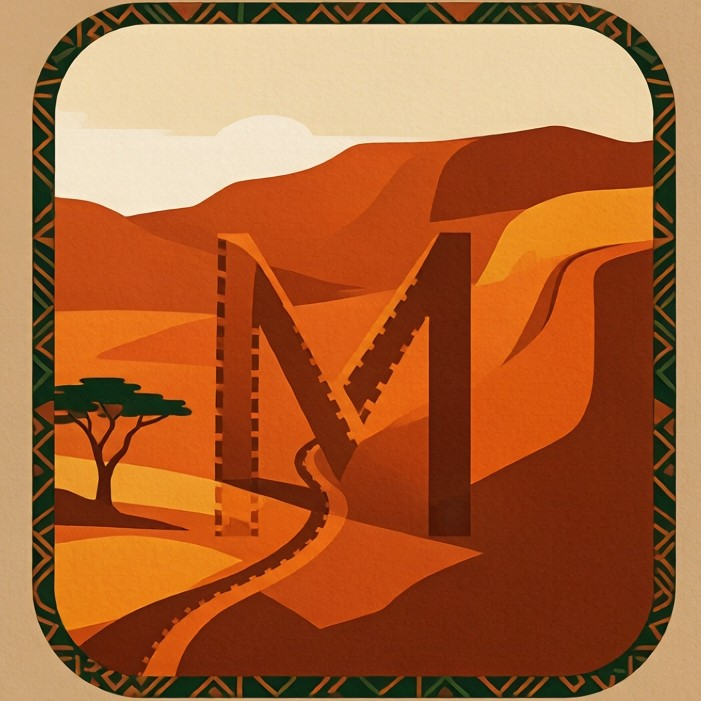

<div align="center">

# Mwendo



**The open-source running tracker, teacher, and challenge platform — built in Kenya, for the world.**

[](https://flutter.dev)
[](https://dart.dev)
[](https://go.dev)
[](./LICENSE-MIT)

*Measure every step. Learn the craft of running. Celebrate East African heritage. All without a black-box AI coach — just your own effort, knowledge, and community.*

</div>

---

## Table of Contents

- [Why Mwendo?](#why-mwendo)
- [Features](#features)
- [Architecture](#architecture)
- [Project Structure](#project-structure)
- [Getting Started](#getting-started)
- [Development Notes](#development-notes)
- [Licensing](#licensing)
- [Roadmap & Status](#roadmap--status)
- [Contributing](#contributing)
- [Acknowledgements](#acknowledgements)

---

## Why Mwendo?

Most running apps lock your data behind proprietary clouds, demand a fast connection, and bury the
sport's rich heritage under gamified noise. **Mwendo** takes the opposite stance:

- **Privacy-first** — your runs are recorded and stored on your device. Cloud sync is opt-in.
- **Offline-first** — full tracking, education, and challenges work without a signal. Note: Maps currently require an internet connection.
- **Open by default** — every line of code, map, and lesson is released under an open licence.
- **Built for real conditions** — designed for low-end devices and intermittent connectivity,
  with a deep respect for East African running culture.

Mwendo is more than a tracker. It is a companion that teaches the science of running, connects you
to the legends who shaped the sport, and motivates you through challenges, streaks, and friendly
leaderboards.

---

## Features

### Track every run
- **Native GPS engine** — a custom Flutter plugin (Kotlin on Android, Swift on iOS, Dart FFI bridge) keeps
  recording through a foreground service / background location session, so a run survives a locked
  screen or a backgrounded app.
- **Live dashboard** — distance, elapsed time, current & average pace, speed,
  elevation gain, and calories update in real time.
- **Smart Time Tracking** — distinguishes between total elapsed time and actual moving time, seamlessly pausing the running pace calculation when you are stationary.
- **Live map** — a breadcrumb trail and current-location marker that follow you as you move.
- **Wall-clock timer** — the run timer ticks from the moment you press Start, independent of GPS
  signal, so it never appears frozen when satellites are scarce.
- **Crash recovery** — an interrupted run is automatically detected and restored on next launch.
- **Serial command locking** — rapid start/pause/resume/stop taps are queued so they can never
  race.

### Maps
- **MapLibre GL basemap** — renders the highly legible Carto Dark style
  over a seamless WebGL engine. Requires an internet connection for tile fetching, providing crisp, zoomable cartography globally.
- **Unified map widget** — `MwendoMap` handles both live tracking (`live` mode) and post-run replay (`replay` mode) in a single component, so drawing and camera logic stay in sync. All offline loopback server dependencies have been removed in favor of a stable online map client.
- **EMA-smoothed live polyline** — the live tracking view applies an accuracy-driven exponential-moving-average on lat/lng and drops sub-5 m jitter, so consumer-chip GPS noise doesn't zigzag the on-screen route. The replay view uses the raw stored points.

### Learn & celebrate
- **Running education** — an in-app academy covering technique, training science, and health.
- **East African legends** — 30 interactive profiles (Kenya, Ethiopia, Uganda & more) with
  biographies, career timelines, personal bests, training philosophy, rivalries, notable races,
  categorized quotes, fun facts, and cross-linked related legends. Filter by country, discipline,
  and era; tap a rival or related legend to jump straight to their profile.
- **How You Compare** — on each legend's page, Mwendo matches your logged PBs (5K, 10K, half,
  marathon) against the legend's records and shows the gap with a progress bar. No runs yet? A
  prompt gets you out the door.
- **Legend of the Day / Week** — a rotating card on the home screen surfaces a new legend (and a
  fun fact) every day, with one tap into their full story.
- **Beat the Legends** — ghost-runner challenges racing against legendary performances, now with a
  Bronze / Silver / Gold / G.O.A.T. difficulty tier selector (125% → 100% of the record time) so
  runners of any level can take on a legend.
- **Challenges & gamification** — XP, levels, badges, streaks, and leaderboards to keep you
  coming back.

### Safety
- **Emergency SOS** — one tap sends your live GPS coordinates to pre-set emergency contacts.

### Sync & community
- **Accounts & cloud sync** — sign in to submit runs and climb the leaderboard; stay anonymous
  and keep everything local if you prefer.
- **Multilingual** — English and Swahili at launch, with full `i18n` throughout the UI.
- **Export** — GPX and JSON export of your activities to share or back up.

> Mwendo follows a multi-pillar blueprint (tracking, education, legends, challenges, gamification,
> safety, and more). The pillars above are the ones implemented today; the rest are on the roadmap.

---

## Architecture

Mwendo is a monorepo split into a mobile app, a backend service, and reusable native/Dart packages.

| Layer | Technology |
|-------|------------|
| **Mobile app** | Flutter & Dart, Riverpod (state), go_router (routing), drift/SQLite (local store), MapLibre GL (maps) |
| **GPS engine** | Native Flutter plugin — Kotlin (Android) + Swift (iOS) + Dart, architecturally based on the Apache-2.0 [OpenTracks](https://github.com/OpenTracksApp/OpenTracks) project |
| **FIT parser** | Dart package with a Rust core (FFI) for decoding Garmin FIT files |
| **Backend** | Go REST API with PostgreSQL + PostGIS and Redis cache, containerised via Docker |

---

## Project Structure

```
mwendo/
├── app/                 # Flutter mobile application
├── backend/             # Go backend (auth, activities, leaderboard)
├── packages/
│   ├── mwendo_gps_engine/   # Native GPS tracking plugin (Kotlin/Swift/Dart)
│   └── mwendo_fit_parser/   # FIT file parser (Dart + Rust)
├── docs/                # Design documentation and course content (see LICENSING)
├── tools/               # Development tooling (currently under development)
├── .github/             # CI/CD workflows
├── docker-compose.yml   # Local backend + Postgres + Redis stack
├── Makefile             # Common development tasks (see `make help`)
└── README.md            # This file
```

---

## Getting Started

### Prerequisites
- [Flutter SDK](https://docs.flutter.dev/get-started/install) (3.x)
- A Go toolchain (1.22+) for the backend
- An Android or iOS device/emulator with developer mode

### Run the mobile app

```bash
cd app
flutter pub get
flutter run            # launches on a connected device or emulator
```

### Run the backend (local stack)

```bash
cd backend
go run ./cmd/api       # serves the REST API (see backend/cmd/api/main.go)
# or, with Docker:
docker compose up -d   # starts API, PostgreSQL, Redis (see docker-compose.yml at repo root)
```

The app talks to the backend over `POST /api/v1/auth/*`, `/api/v1/activities`, and
`/api/v1/leaderboard/submit`. Anonymous runs never leave the device.

---

## Development Notes

A few platform specifics worth knowing before you build or review:

- **Background location permission (critical for real runs).** The tracker requests
  `locationWhenInUse`, then `locationAlways`. On Android 10+ the foreground location service only
  keeps delivering updates while the screen is off if the user grants **"Allow all the time"** —
  otherwise tracking freezes when the screen locks. The app warns when this is denied; keeping the
  screen on also works.
- **GPS plugin build fix.** `MwendoTrackingService.activityId` is package-visible (not `private`)
  and the `@SuppressLint` annotation was removed, because `androidx.annotation` is not on the AGP 9
  classpath. MapLibre GL currently requires a Java 21 compilation environment.
- **Automated CI/CD via GitHub Actions.** Pushing a `v*` tag triggers a workflow that compiles a
  debug APK (Java 21) and attaches it to a new GitHub Release.
- **The run timer is wall-clock driven.** `elapsedMs` is accumulated by a 1 s ticker started on
  `start()` and banked on pause/stop. GPS feeds distance, pace, and calories only — the timer
  itself never depends on a satellite fix. A run that moves less than 1 m is still not saved (the
  `distanceM < 1` guard is intentional).
- **Single map widget, two modes.** `MwendoMap` (`app/lib/widgets/mwendo_map.dart`) serves both
  live tracking (`live` mode) and post-run replay (`replay` mode). In `live` mode it draws the
  recorded `trackPoints` polyline as it streams in and follows the runner with north-up native
  tracking (`MyLocationTrackingMode.tracking`); explicit `+/-` zoom buttons and a re-center button
  (shown after the user pans away) give full manual camera control. In `replay` mode the camera is
  set once and never moves, and the route redraws when points load asynchronously. Line drawing is
  serialized (`_isSyncing` / `_pendingCoords`), updated in place via `updateLine`, and stale lines
  are cleared when fewer than two points remain. `RouteMap` (`app/lib/widgets/route_map.dart`) is a
  thin wrapper over `MwendoMap` in `replay` mode.
- **Development tasks.** Common commands are wrapped in the root `Makefile` — run `make help` for
  a list (e.g., `make test`, `make lint`, `make build-apk`).

For deeper internals (map syncing, EMA smoothing, state machines, run-sequence crash fixes), see
[`docs/audit.md`](docs/audit.md) and [`docs/implementation_plan.md`](docs/implementation_plan.md).

---

## Licensing

Mwendo is open source under a per-component licence model:

| Component | Licence |
|-----------|---------|
| Mobile app & local packages (`app/`, `packages/`) | MIT or Apache-2.0 |
| Backend (`backend/`) | AGPL-3.0 |
| Educational content (`docs/`) | **Proprietary to Mwendo project** — see [CONTRIBUTING.md](CONTRIBUTING.md) for reuse terms. |

> **Note:** The `docs/` directory currently carries no standard CC licence file. Content reuse terms
> are under active discussion. For now, treat educational content as project-proprietary.

See [`LICENSE-MIT`](./LICENSE-MIT), [`LICENSE-APACHE`](./LICENSE-APACHE), and
[`LICENSE-AGPL`](./LICENSE-AGPL).

---

## Roadmap & Status

- ✅ Core tracking (GPS, live dashboard, crash recovery, foreground service)
- ✅ MapLibre GL live/replay maps with EMA smoothing
- ✅ Education academy + 30 legend profiles + "How You Compare"
- ✅ Ghost challenges with 4 difficulty tiers
- ✅ Gamification (XP, levels, badges, streaks, leaderboards)
- ✅ Emergency SOS
- ✅ Auth + cloud sync + GPX/JSON export
- ⬜ iOS background execution parity with Android (foreground service ↔️ background location)
- ⬜ Offline map tiles (MapLibre offline regions)
- ⬜ Wear OS / watchOS companion
- ⬜ Backend-driven challenge/leaderboard sync (currently local-only)
- ⬜ Full CI matrix (integration tests, golden image tests)

See [`docs/implementation_plan.md`](docs/implementation_plan.md) for the full roadmap and pillar breakdown.

---

## Contributing

Contributions are welcome — whether code, translations, course content, or bug reports. Please open
an issue to discuss substantial changes first, and ensure `flutter analyze` (and `go vet` for the
backend) pass before submitting a pull request.

---

## Acknowledgements

Mwendo's native GPS engine is architecturally inspired by the Apache-2.0-licensed
[OpenTracks](https://github.com/OpenTracksApp/OpenTracks) project, reimplemented clean-room for the
Flutter plugin. Heartfelt thanks to the East African running community whose heritage this project
exists to celebrate.

---

<div align="center">

**Mwendo** — *your effort, your knowledge, your community.*

</div>